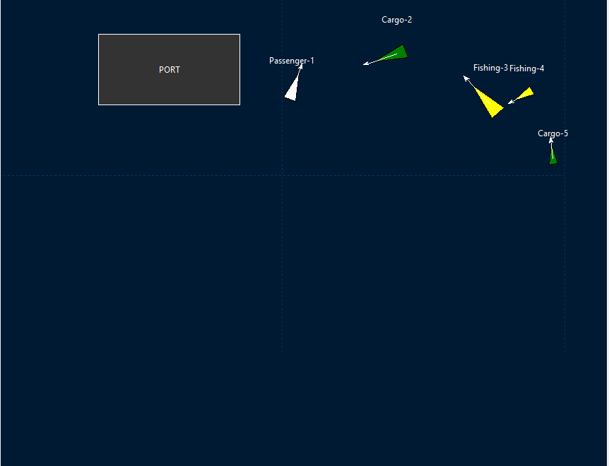
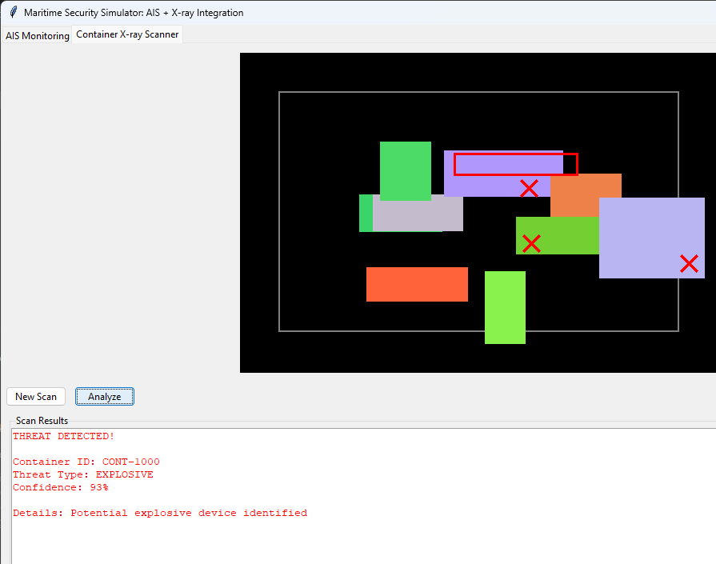

# Maritime Security Simulator: AIS + X-ray Integration


A comprehensive maritime security simulation tool that integrates AIS (Automatic Identification System) ship tracking with container X-ray scanning capabilities for threat detection.

## Features

- **AIS Monitoring System**:
  - Real-time ship tracking with simulated AIS messages
  - Visual representation of ship positions, courses, and speeds
  - Ship information display (MMSI, type, position, etc.)
  - Dynamic ship movement simulation

- **Container X-ray Scanner**:
  - Synthetic X-ray image generation
  - Threat detection algorithms (weapons, drugs, explosives)
  - False positive/negative simulation for realistic analysis
  - Detailed scan reports with confidence levels

- **Integrated Workflow**:
  - Select ships from AIS map for container inspection
  - Cross-reference container data with ship manifests
  - Threat alert system with visual indicators

## Screenshots

**AIS Monitoring Interface**  
  

**X-ray Scan with Explosive Detection**  
  

## Installation

1. Clone the repository:
   ```bash
   https://github.com/Jean6114/AIS-X-ray.git
   cd AIS-X-ray
